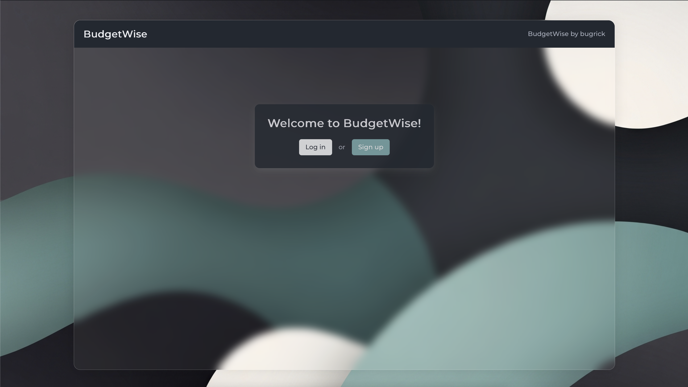
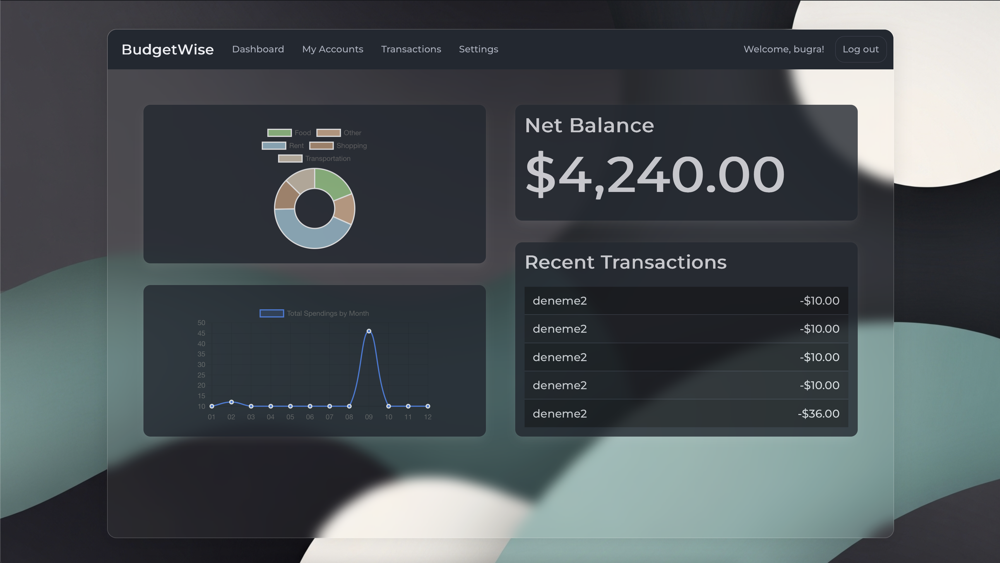

# 💰 BudgetWise: Your Personal Financial Compass

BudgetWise is a powerful yet simple **personal finance tracker** designed to empower you with a clear understanding of your financial life. Built with a robust backend using Flask and an intuitive frontend powered by Bulma and Chart.js, this application helps you **log transactions, categorize expenses, and visualize your spending habits** through an elegant and interactive dashboard.

The core philosophy behind BudgetWise is to provide a tool that is both easy to use for daily tracking and insightful for long-term financial planning. Whether you're saving for a goal, trying to cut back on spending, or simply want to know where your money is going, BudgetWise offers the clarity you need.

## 🎥 Video Demonstration
See BudgetWise in action! This video provides a complete walkthrough of the application's features and functionality.

## **Video Demo https://youtu.be/QaGPdCwhGLs**



---

## 🚀 Core Features in Detail

BudgetWise is packed with features designed to make financial tracking a seamless experience.

* **🔐 Secure User Authentication:** Your financial data is sensitive, which is why security is a top priority. BudgetWise includes a full authentication system for user registration, login, and logout. Passwords are never stored in plaintext; instead, they are salted and hashed using the industry-standard `werkzeug.security` library, ensuring your account remains protected.

* **🌑 Light & 🌕 Dark Mode:** The user interface is designed for comfort, offering both a clean, bright light mode for daytime use and a sleek, eye-friendly dark mode for low-light environments. The application automatically respects your system's theme preference.

* **➕ Intuitive Transaction Management:** Manually add transactions with all the necessary details: amount, category, a descriptive note, and the date. This hands-on approach encourages mindful spending and gives you complete control over your financial records.

* **📊 Interactive Data Dashboard:** The heart of BudgetWise is its dynamic dashboard, which brings your financial data to life with the help of **Chart.js**.
    * **Spending by Category (Pie Chart):** Get an at-a-glance overview of your spending distribution. Instantly see which categories, like "Food," "Transport," or "Entertainment," are consuming the largest portions of your budget.
    * **Expenses Over Time (Line Chart):** Track your spending trends on a monthly basis. This chart helps you identify patterns, recognize seasonal spending spikes, and measure your progress toward your financial goals over time.

---

## 🛠️ A Modern & Reliable Tech Stack

BudgetWise is built on a foundation of proven and popular technologies, ensuring reliability, scalability, and a great developer experience.

* **Backend:** **Python** and the lightweight **Flask** web framework form the core of the application logic. Flask's simplicity and flexibility allow for rapid development without sacrificing power.
* **Database:** A **SQLite** database provides a simple, serverless, and file-based storage solution, perfect for personal applications. **SQLAlchemy**, an Object-Relational Mapper (ORM), is used to interact with the database using clean and intuitive Python code instead of raw SQL.
* **Frontend:** The user interface is built with standard **HTML** and styled with the modern CSS framework **Bulma**. Bulma's class-based system makes it easy to create responsive and visually appealing designs. **Chart.js** is used for rendering the beautiful and interactive charts on the dashboard.
* **Security:** **Werkzeug** provides the essential tools for securely hashing and verifying passwords, a critical component of the authentication system.

---

## 📂 Project Architecture

The project is structured to follow standard Flask application conventions, promoting a clean separation of concerns.

budgetwise/
│
├── app.py             # Main Flask application file containing routes and logic
├── helpers.py         # Utility functions (e.g., currency formatting)
├── requirements.txt   # A list of all Python dependencies for easy installation
│
├── screenshots/       # Application screenshots for the README
│
├── templates/         # All HTML templates rendered with Jinja2
│   ├── index.html
│   ├── login.html
│   ├── signup.html
│   ├── settings.html
│   ├── layout.html
│   ├── transactions.html
│   └── .html
│
└── static/            # All static assets served to the client
├── css/
│   ├── bulma.css
│   └── styles.css
│   ├── background-dark.png
│   ├── background-light.png


---

## ⚡ Getting Started: Installation & Setup Guide

Follow these steps to get a local copy of BudgetWise up and running on your machine.

1.  **Clone the Repository:**
    First, clone the project from GitHub to your local machine.
    ```bash
    git clone [https://github.com/bugrick-dev/budgetwise.git](https://github.com/bugrick-dev/budgetwise.git)
    cd budgetwise
    ```

2.  **Create and Activate a Virtual Environment:**
    It is highly recommended to use a virtual environment to manage project dependencies and avoid conflicts with other Python projects.
    ```bash
    # For macOS/Linux
    python3 -m venv venv
    source venv/bin/activate

    # For Windows
    python -m venv venv
    venv\Scripts\activate
    ```

3.  **Set Environment Variables:**
    Flask needs to know which file to run. Set the `FLASK_APP` environment variable.
    ```bash
    # For macOS/Linux
    export FLASK_APP=app.py

    # For Windows
    set FLASK_APP=app.py
    ```

4.  **Install Dependencies:**
    Install all the required Python libraries listed in the `requirements.txt` file.
    ```bash
    pip install -r requirements.txt
    ```

5.  **Initialize the Database:**
    BudgetWise includes a custom Flask command to create the SQLite database and its tables based on the SQLAlchemy models.
    ```bash
    flask init-db
    ```

6.  **Run the Development Server:**
    You're all set! Start the Flask development server.
    ```bash
    flask run
    ```

7.  **Open in Your Browser:**
    Navigate to the following URL in your web browser to start using BudgetWise.
    ```
    [http://127.0.0.1:5000](http://127.0.0.1:5000)
    ```

## 📊 Example Dashboard in Action

The dashboard is where you'll find the most valuable insights into your finances.



---

## 📝 Roadmap & Future Improvements

BudgetWise is an evolving project with many exciting features planned for the future.

* **🔄 Currency Conversion API:** Integrate a real-time currency conversion API to support users who deal with multiple currencies.
* **📱 Enhanced Mobile View:** Further optimize the dashboard and forms for a seamless experience on mobile devices.
* **📊 Export Reports:** Allow users to export their transaction data and spending reports as PDF or CSV files for offline analysis or record-keeping.
* **👥 Shared Accounts:** Introduce the ability to create shared accounts for couples or groups to manage a budget together.
* **🚀 Mobile Application:** Develop a dedicated mobile application for iOS and Android to make tracking on-the-go even easier.